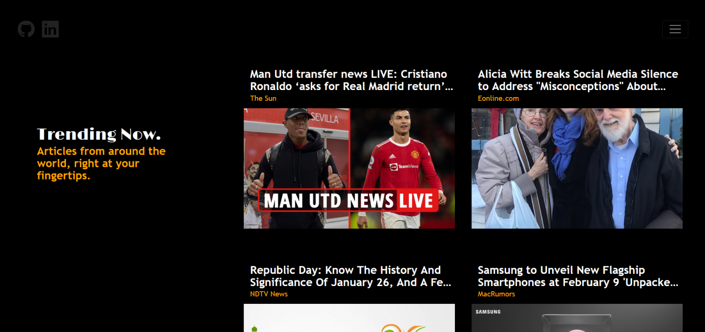

<div id="top"></div>
<!--
*** Thanks for checking out the Best-README-Template. If you have a suggestion
*** that would make this better, please fork the repo and create a pull request
*** or simply open an issue with the tag "enhancement".
*** Don't forget to give the project a star!
*** Thanks again! Now go create something AMAZING! :D
-->


<!-- PROJECT SHIELDS -->
<!--
*** I'm using markdown "reference style" links for readability.
*** Reference links are enclosed in brackets [ ] instead of parentheses ( ).
*** See the bottom of this document for the declaration of the reference variables
*** for contributors-url, forks-url, etc. This is an optional, concise syntax you may use.
*** https://www.markdownguide.org/basic-syntax/#reference-style-links
-->
[![Contributors][contributors-shield]][contributors-url]
[![Forks][forks-shield]][forks-url]
[![Stargazers][stars-shield]][stars-url]
[![Issues][issues-shield]][issues-url]
[![MIT License][license-shield]][license-url]
[![LinkedIn][linkedin-shield]][linkedin-url]


<!-- PROJECT LOGO -->
<br />
<div align="center">
  <a href="https://github.com/lieuk1/News-Web-App">
    
  </a>
  
  <h3 align="center"><strong>News Web App</strong></h3>
  <p>
    <p>A simple news web application</p>
    <a href="https://github.com/lieuk1/News-Web-App"><strong>Explore the docs »</strong></a>
    <br />
    <br />
    <a href="#usage">View Demo</a>
    -
    <a href="https://github.com/lieuk1/News-Web-App/issues">Report Bug</a>
    -
    <a href="https://github.com/lieuk1/News-Web-App/issues">Request Feature</a>
  </p>
</div>


<!-- TABLE OF CONTENTS -->
<details>
  <summary>Table of Contents</summary>
  <ol>
    <li>
      <a href="#about-the-project">About The Project</a>
      <ul>
        <li><a href="#built-with">Built With</a></li>
      </ul>
    </li>
    <li>
      <a href="#getting-started">Getting Started</a>
      <ul>
        <li><a href="#prerequisites">Prerequisites</a></li>
        <li><a href="#installation">Installation</a></li>
      </ul>
    </li>
    <li><a href="#usage">Usage</a></li>
    <li><a href="#roadmap">Roadmap</a></li>
    <li><a href="#contributing">Contributing</a></li>
    <li><a href="#license">License</a></li>
    <li><a href="#contact">Contact</a></li>
    <li><a href="#acknowledgments">Acknowledgments</a></li>
  </ol>
</details>


<!-- ABOUT THE PROJECT -->
## About The Project

**News Web App**




### Built With

* [Python](https://www.python.org/)
* [Flask](https://pypi.org/project/Flask/)
* [JavaScript (jQuery, AJAX)](https://developer.mozilla.org/en-US/docs/Web/javascript)
* [SQL & SQLite](https://docs.python.org/3/library/sqlite3.html)
* [Bootstrap](https://getbootstrap.com/)
* [HTML & CSS](https://www.w3schools.com/html/default.asp)


<!-- GETTING STARTED -->
## Getting Started

To get a local copy up and running follow these simple example steps.

### Prerequisites

If you haven't done so already, install the following:
- Python
- [pip](https://pip.pypa.io/en/stable/installation/)
- [virtualenv](https://www.tutorialspoint.com/flask/flask_environment.htm)


### Installation

1. Get a free [News API key](https://newsapi.org) 
2. Clone the repo
   
   ```sh
   git clone https://github.com/lieuk1/News-Web-App.git
   ```
3. Install virtualenv in the project directory and activate it
4. Install packages from `requirements.txt`
   
   ```sh
   pip install -r requirements.txt
   ```
5. Create a `.env` file in the root project directory (often the same folder as `.gitignore` and `README.md`)
6. Enter your API key in `.env`
   
   ```.env
    api_key=your_key
    FLASK_APP=main.py
    FLASK_ENV=development
   ```
7. Add `.env` to the end of the `.gitignore` file
   
   ```.gitignore
   # sqlite database
   articles.db
   # api keys
   .env
   ```
   Ensure your API keys are not uploaded to GitHub!


<!-- USAGE EXAMPLES -->
## Usage

<!-- Use this space to show useful examples of how a project can be used. Additional screenshots, code examples and demos work well in this space. You may also link to more resources.
-->
<!-- _For a complete overview of usage examples, please refer to the [Documentation]()_ -->

### Available Scripts

In the project directory, you can run:

### `flask run`
or
### `python main.py`


Open the link provided in the command line to view it in the browser. \
You will see any lint errors in the console.


<!-- ROADMAP -->
## Roadmap

- ****Currently in the process of deployment.**
  - Come back soon to view the demo!

See the [open issues](https://github.com/lieuk1/News-Web-App/issues) for a full list of proposed features (and known issues).


<!-- CONTRIBUTING -->
## Contributing

Contributions are what make the open source community such an amazing place to learn, inspire, and create. Any contributions you make are **greatly appreciated**.

If you have a suggestion that would make this better, please fork the repo and create a pull request. You can also simply open an issue with the tag "major enhancement" or "minor enhancement".
Don't forget to give the project a star! Thanks again!

1. Fork the Project
2. Create your Feature Branch (`git checkout -b feature/AmazingFeature`)
3. Commit your Changes (`git commit -m 'Add some AmazingFeature'`)
4. Push to the Branch (`git push origin feature/AmazingFeature`)
5. Open a Pull Request


<!-- LICENSE -->
## License

Distributed under the MIT License. See [LICENSE.txt](https://github.com/lieuk1/News-Web-App/blob/main/LICENSE.txt) for more information.


<!-- CONTACT -->
## Contact

Kristella Lieu - lieuk1@tcnj.edu

Project Link: [https://github.com/lieuk1/News-Web-App](https://github.com/lieuk1/News-Web-App)


<!-- ACKNOWLEDGMENTS -->
## Acknowledgments

* [Television](https://icons8.com/icon/fbAvklUk7Ckm/television) icon by [Icons8](https://icons8.com)
* [Best-README-Template](https://github.com/othneildrew/Best-README-Template)

<p align="right">(<a href="#top">back to top</a>)</p>


<!-- MARKDOWN LINKS & IMAGES -->
<!-- https://www.markdownguide.org/basic-syntax/#reference-style-links -->
[contributors-shield]: https://img.shields.io/github/contributors/lieuk1/News-Web-App.svg?style=for-the-badge
[contributors-url]: https://github.com/lieuk1/News-Web-App/graphs/contributors
[forks-shield]: https://img.shields.io/github/forks/lieuk1/News-Web-App.svg?style=for-the-badge
[forks-url]: https://github.com/lieuk1/News-Web-App/network/members
[stars-shield]: https://img.shields.io/github/stars/lieuk1/News-Web-App.svg?style=for-the-badge
[stars-url]: https://github.com/lieuk1/News-Web-App/stargazers
[issues-shield]: https://img.shields.io/github/issues/lieuk1/News-Web-App.svg?style=for-the-badge
[issues-url]: https://github.com/lieuk1/News-Web-App/issues
[license-shield]: https://img.shields.io/github/license/lieuk1/News-Web-App.svg?style=for-the-badge
[license-url]: https://github.com/lieuk1/News-Web-App/blob/main/LICENSE
[linkedin-shield]: https://img.shields.io/badge/-LinkedIn-black.svg?style=for-the-badge&logo=linkedin&colorB=555
[linkedin-url]: https://www.linkedin.com/in/krystelle-lieu-aa4110148/
[product-screenshot]: images/screenshot.png
